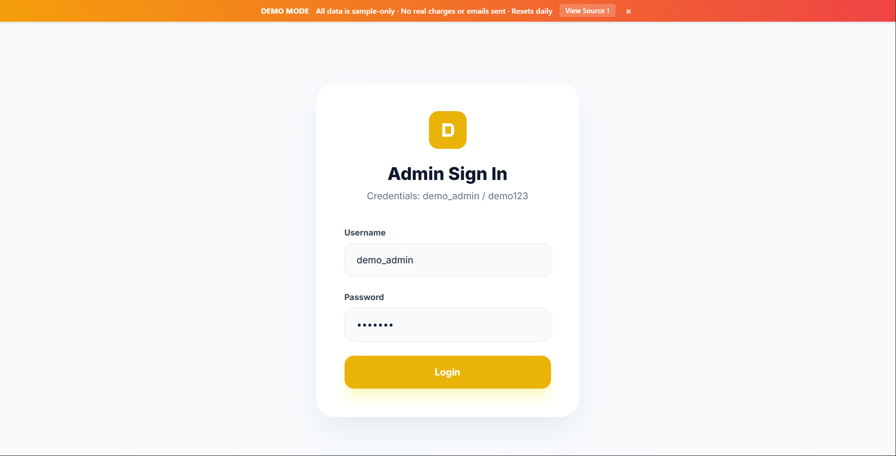
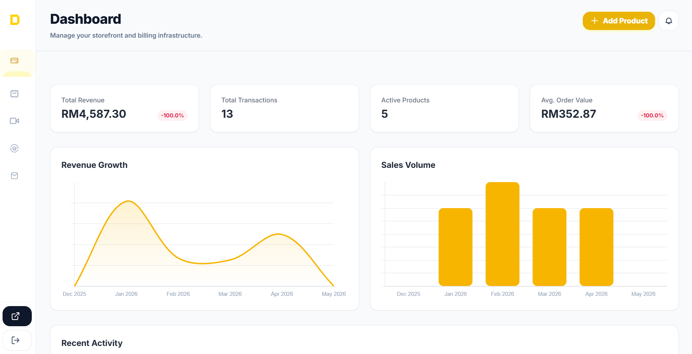
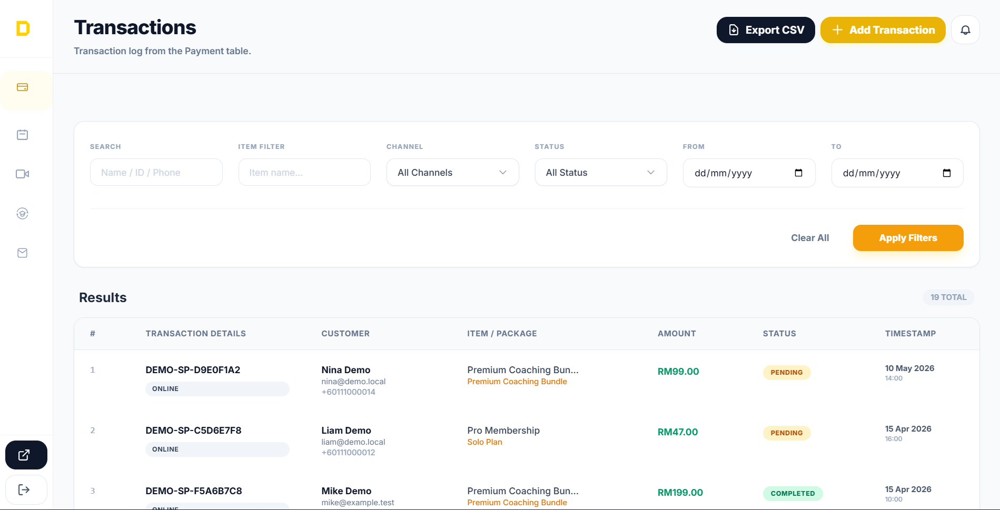
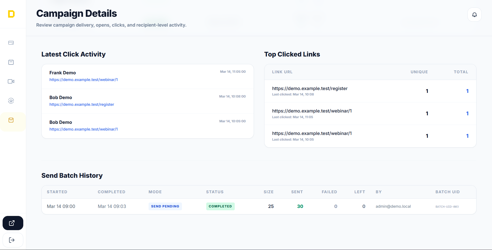
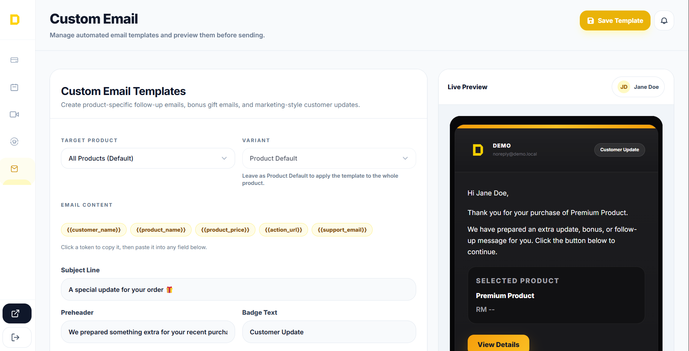
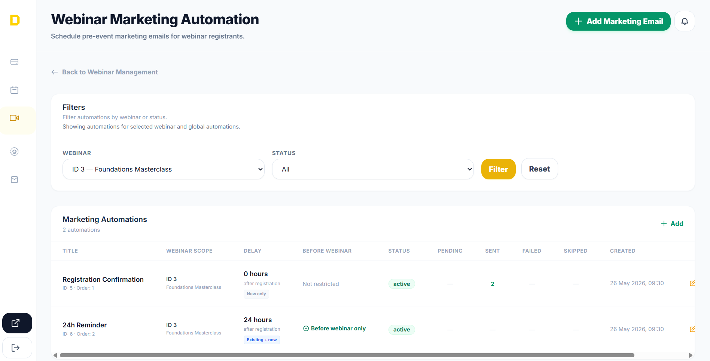
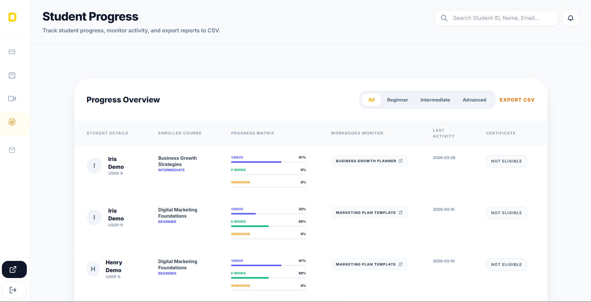
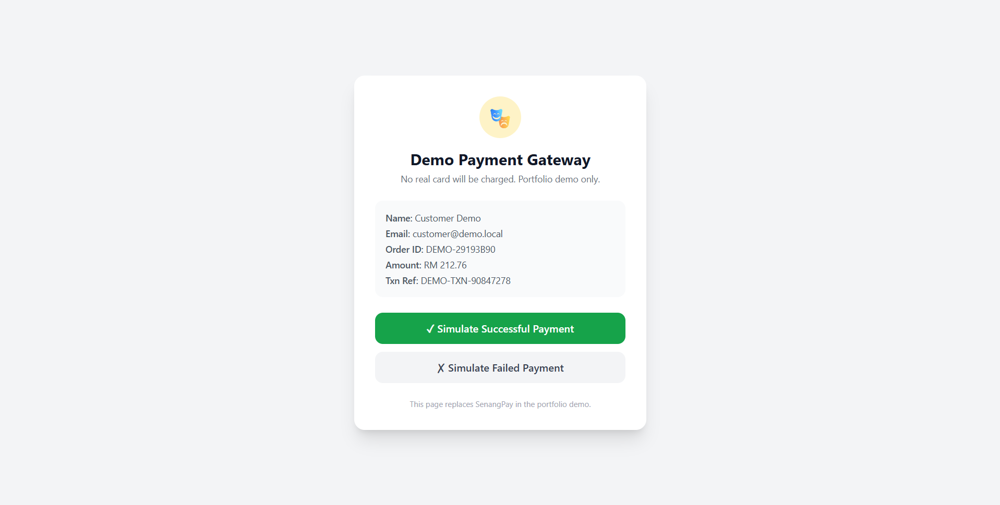

# Admin Panel — Demo

> This is a sanitized demo of a production PHP admin panel I built for an online education and digital products business. All credentials, customer data, payment integrations, and external API connections have been replaced with stubs. No real charges are made, no real emails are sent, and no real customer data is stored.

**Live demo:** [demo-panel.infinityfreeapp.com](https://demo-panel.infinityfreeapp.com)
**Login:** `demo_admin` / `demo123` — auto-fill button on the login page
**Source:** [github.com/SyedIhsan/admin-panel](https://github.com/SyedIhsan/admin-panel)

---

## Screenshots

### Login

Demo mode banner, auto-fill credentials button, branded sign-in page.

### Payment Dashboard

Revenue KPI cards, growth chart with date-range filter, sales volume breakdown, recent activity feed.

### Transactions

Paginated transaction list with status badges, search, and per-row detail drill-down.

### Email Campaign Editor

Quill-powered HTML campaign editor with live preview, audience targeting, and send scheduling.

### Custom Email Composer

One-off email composer with template selection and recipient targeting.

### Webinar Automation

Automated reminder sequences, marketing email scheduling, and registration tracking.

### Student Progress

Per-student course progress view with completion percentage, certificate status, and workbook submissions.

### Demo Gateway

Stub payment gateway — simulates success and failure flows without touching a real payment processor.

---

## What is this?

This is a backend admin panel I built for a real business running online courses, digital product sales, and live webinars. The production system handles subscription billing, automated email sequences, course content delivery, and payment reconciliation across two separate databases.

The original codebase had close to 2,000 files after several years of organic growth. For this demo I stripped it down to the ~145 files that matter, replaced all real credentials and integrations with stubs, reconciled the schema into a single demo database, and deployed it with a nightly auto-reset so it always shows fresh sample data.

The goal is to show how the system is structured and what the engineering decisions look like — not to demo a finished product.

### Modules

| Module | What it manages |
|---|---|
| **Payment** | One-time purchases, installment plans, discount codes, manual transactions |
| **Subscriptions** | Recurring billing, renewal/retention flows, status lifecycle |
| **Webinars** | Registration, automated reminder sequences, marketing email campaigns |
| **e-Learning** | Course content, student progress tracking, certificate generation (FPDF) |
| **Email Campaigns** | Audience groups, segmentation, campaign scheduling, open/click tracking |

---

## Technical highlights

- **Strict types throughout** — every PHP file opens with `declare(strict_types=1)`. This catches type coercion bugs at call sites before they become data integrity bugs.

- **CSRF on every POST** — `csrf_token()` generates a rotating per-session token stored in `$_SESSION`; `csrf_validate()` checks it at the top of every POST handler before any DB write. Never skipped.

- **Prepared statements only** — zero string interpolation into SQL across the entire codebase. All user input goes through `bind_param`.

- **Single escape function** — `h()` wraps `htmlspecialchars()` with `ENT_QUOTES | ENT_SUBSTITUTE`. Raw `echo` of user-controlled data does not exist in this codebase.

- **Environment-aware data filter** — `ENV_PAY_WHERE` is a SQL fragment injected into payment reports to separate live from test transactions. Switching environments doesn't require query edits.

- **Demo mode as a first-class concept** — `DEMO_MODE === true` is a named constant defined in bootstrap. Every side-effecting operation (email delivery, payment gateway calls, reset endpoint) checks it explicitly. No DEMO_MODE = no risk.

- **Self-healing schema approach** — rather than running migrations against production, the demo schema is rebuilt from a single `schema.sql` on every reset. All schema decisions are visible in one file.

- **Split-token device trust** (production only) — the MFA bypass token uses a selector + hashed-validator pattern. The selector is stored in plain text for lookup; only the hash is stored. Leaking the DB doesn't leak valid tokens.

---

## Tech stack

| Layer | Technology |
|---|---|
| Runtime | PHP 8.2, Apache |
| Database | MySQL 8.0, MySQLi with prepared statements |
| Frontend | Tailwind CSS via CDN, Quill rich-text editor |
| PDF generation | FPDF (bundled, no composer) |
| Email (production) | AWS SES + Brevo |
| Payments (production) | SenangPay, Stripe |
| Hosting (demo) | InfinityFree shared hosting |
| Reset automation | cron-job.org, daily 04:00 UTC |

No build step. No framework. No composer autoloader. Dependencies are either bundled or loaded via CDN.

---

## Architecture notes

### Module-based routing

There is no router. Each module lives in its own directory under `admin/` (`payment/`, `email/`, `webinar/`, `elearning/`, `subscription/`). Every page is a standalone PHP file that includes shared partials (`header.php`, `nav.php`, `footer.php`) and handles its own GET/POST logic. Shared utilities (DB connection, auth, CSRF, helpers) are pulled in via `_init.php` or `bootstrap.php` at the top of each file.

This is the pattern the codebase was built with and it works well at this scale. For a larger team or more complex routing requirements I'd use a proper router, but for a single-developer admin panel it keeps things easy to navigate.

### Demo mode pattern

Rather than maintaining a separate demo branch, the demo is a runtime mode. `admin/bootstrap.php` defines `DEMO_MODE = true`. The single change that makes the whole system safe for public access is:

- `api/ses-config.php` replaces `sendBrevo()` and `sendSES()` with stubs that write HTML files to `demo/mail-outbox/`
- `payment/payment.php` replaces the SenangPay redirect with `demo-gateway.php`
- `payment/process-renewal.php` and `process-retention.php` return stub JSON before hitting any gateway
- `demo/reset.php` requires `DEMO_MODE === true` before it will drop any tables

All other code is unchanged from the production version. This means the demo genuinely reflects how the system behaves, not a watered-down simulation.

### Dual-database → single-database

Production runs on two separate MySQL databases — one for payment/subscription data, one for e-learning and email data. The databases are on separate servers for isolation. `api/db_router.php` handles connection routing based on which module is executing.

For the demo this was collapsed into one database. The schema was reconciled by hand: tables from both databases were renamed where they conflicted, foreign key relationships were verified, and a single `schema.sql` was produced. The router still exists and still works — it just routes both connections to the same demo DB.

### Shared-host deployment compromises

The demo runs on InfinityFree free tier. Two things required workarounds:

1. **`CREATE VIEW` is denied** — `order_products` was originally a view over `Orders`. Replaced with a real table populated via `INSERT ... SELECT` in `seed.sql`.
2. **No environment variables** — the nightly reset token is stored in a gitignored `demo/env.prod.php` rather than a server env var (InfinityFree doesn't support custom env vars on free tier).

Both are documented in `demo/PROD_DEPLOY_NOTES.md`.

---

## Local development

**Requirements:** PHP 8+, MySQL 8+, a local web server (XAMPP, Laragon, etc.)

```bash
git clone https://github.com/SyedIhsan/admin-panel.git
# Drop the folder into your web root (e.g. C:\xampp\htdocs\)
```

1. Create a MySQL database (e.g. `demo_panel`)
2. Import `demo/schema.sql` then `demo/seed.sql` via phpMyAdmin or CLI
3. Copy the config template:
   ```
   cp demo/db-config.example.php demo/db-config.php
   ```
4. Edit `demo/db-config.php` with your local credentials
5. Browse to `http://localhost/admin/`

To reset the database to seed state at any time:
```
php demo/reset.php
```

---

## What is NOT in this demo

| Feature | Production | Demo |
|---|---|---|
| Authentication | Email MFA + trusted devices (split-token) | Password only, MFA bypassed |
| Payment processing | SenangPay + Stripe live API | Stub gateway page |
| Email delivery | AWS SES + Brevo API | Written to `demo/mail-outbox/*.html` |
| Course video hosting | Google Drive API | Static sample URL |
| Student import | Google Sheets API | Hardcoded sample rows |
| Database architecture | Two databases on separate servers | Single demo DB |
| Receipt PDF | Real FPDF generation with customer data | Stub (no real order data) |
| MFA device tokens | Split-token DB table + cookie flow | Not present |

None of these are missing because they were too hard to implement. They were removed because they require live credentials, real customer data, or external API accounts that can't be shared publicly.

---

## Project journey

The production codebase accumulated over several years with organic scope growth. Converting it to a shareable demo was its own project:

- **Phase 1–2:** audit 1,929 files, delete dead code and credentials, stub out all external calls
- **Phase 3:** reconcile dual-DB schema into a single demo database, rebuild seed data from scratch, fix all the bugs that only showed up when the two databases merged
- **Phase 4:** demo-mode polish — empty states, nightly reset endpoint, safety audit, documentation
- **Phase 5–6:** InfinityFree deployment, production-specific fixes (CREATE VIEW workaround, env filter bug)
- **Phase 7:** screenshots, README, this document

The biggest surprise was how much implicit coupling existed between the two databases. Tables that looked independent had subtle email-address joins that only worked if both DBs were present. The reconciliation work is documented in `_docs/SCHEMA_RECONCILIATION.md`.

---

## About

Built by [Syed Ihsan](https://github.com/SyedIhsan)
